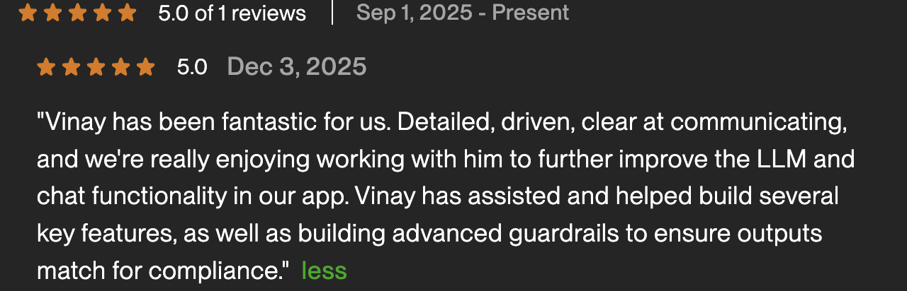
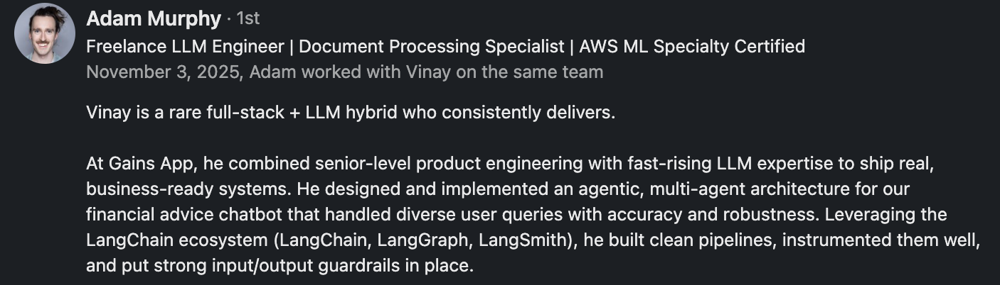
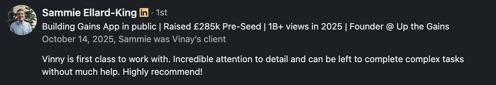

# 🤖 Vinay Devaraja | LLM Engineer | Multi-Agent Systems & RAG Specialist

I architect production-grade AI systems that solve real business problems. My solutions have:

- Vectorized 100,000+ insurance documents for Fortune 30 executives
- Built multi-agent systems with FCA compliance guardrails for fintech
- Deployed enterprise RAG pipelines processing millions of queries

## 🚀 Recent Impact Projects

- **Gains App AI Backend** - Multi-agent financial assistant system using LangChain & LangGraph with real-time compliance monitoring
- **Enterprise Document Intelligence** - RAG system at Carelon powering executive decision-making across 100K+ insurance documents
- **DocItEasy** - SaaS platform automating document collection for solicitors and finance professionals - [DocItEasy](https://dociteasy.io)

## 💡 Technical Philosophy

You dream it, I engineer it to last. I work with founders who see what's possible and need someone equally committed to making it real, scalable, and bulletproof.

## 🎯 Certifications & Expertise

- **Datalumina Certified: AI Engineer Expert** - Advanced certification in production AI systems
- **8+ Years** in full-stack development and cloud infrastructure

## 🛠 Core Tech Stack

- **LLM Orchestration**: LangChain, LangGraph, OpenAI, Anthropic Claude, Gemini
- **Vector Databases**: pgvector, Pinecone, Chroma
- **Infrastructure**: AWS (EC2, ASG, Lambda, S3, RDS), Docker, Kubernetes
- **Backend**: FastAPI, Python, Node.js
- **Frontend**: React, Next.js, TypeScript
- **Monitoring**: Custom observability pipelines, LangSmith

## ⭐ What Clients Say

  

## 🤝 Let's Build Something

Looking for an AI engineer who delivers production-ready systems? I specialise in fintech, enterprise AI, and document intelligence.

🗓️[Book a consultation](https://calendar.app.google/CrdUeaVwYvWYuD9z9) | 📧 [Connect on LinkedIn](https://www.linkedin.com/in/vinay-devaraja/) | 💼 [View on Upwork](https://www.upwork.com/freelancers/vinaydevaraja)

*Operating through [Zwift Labs Limited](https://zwiftlabs.com)*
